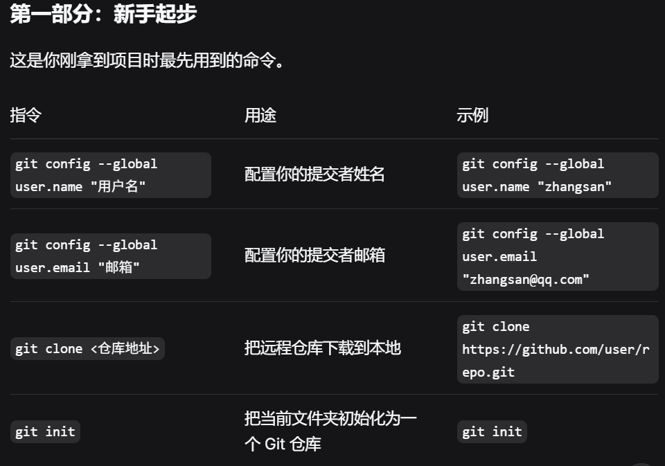
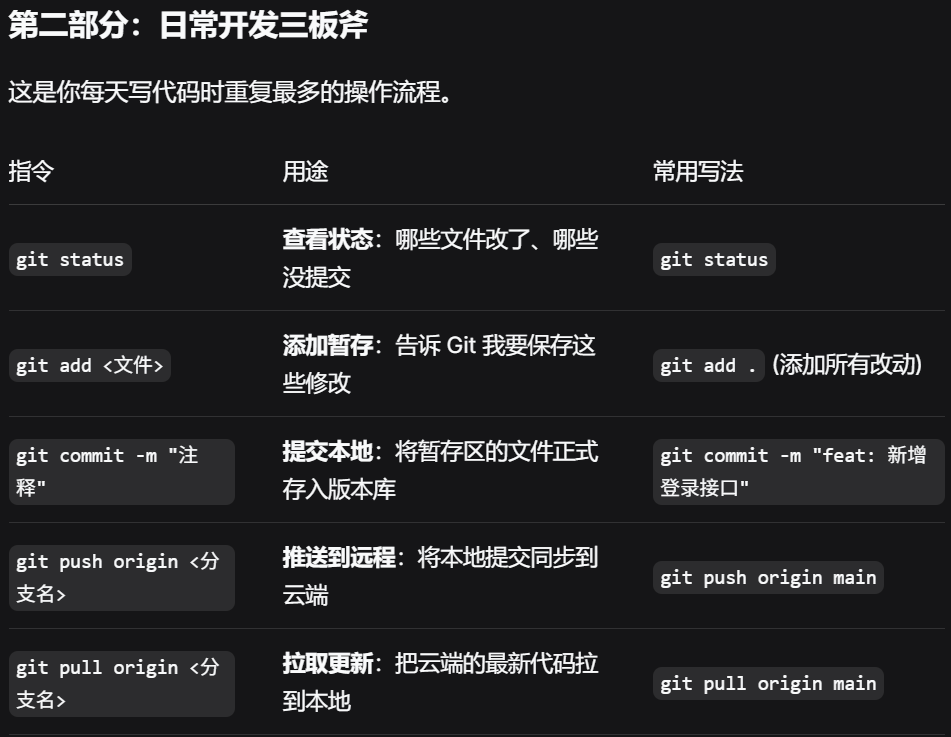
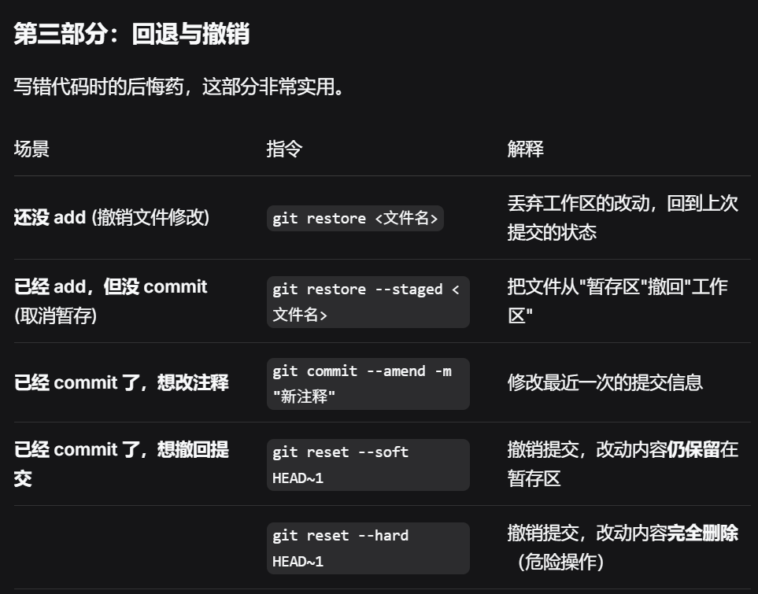
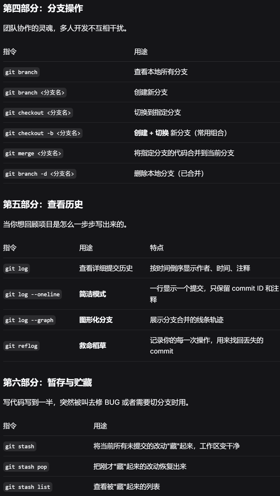

fistWeek：
    1.docker的安装和使用，拉取了mysql、redis的镜像，并且使用docker-compose搭建了一个简单的环境。
    2.用mybatis-plus的CodeGenerator根据数据库的表直接生成了实体类、mapper接口、xml文件等，节省了大量的时间。
    3.使用git来管理代码，学习了基本的git命令，如git clone、git add、git commit、git push等，并且在github上创建了一个仓库来存储代码。

经验总结和纠正：
    1.Git 提交代码时，一个核心原则是：只提交源代码和构建配置文件，忽略所有编译生成的文件、IDE 配置和敏感信息。
    

    2.在使用docker-compose搭建环境时，注意配置文件的正确性和安全性，避免暴露敏感信息。
    3.在使用mybatis-plus的CodeGenerator生成代码时，注意根据实际需求进行调整和优化，避免生成过多冗余的代码。